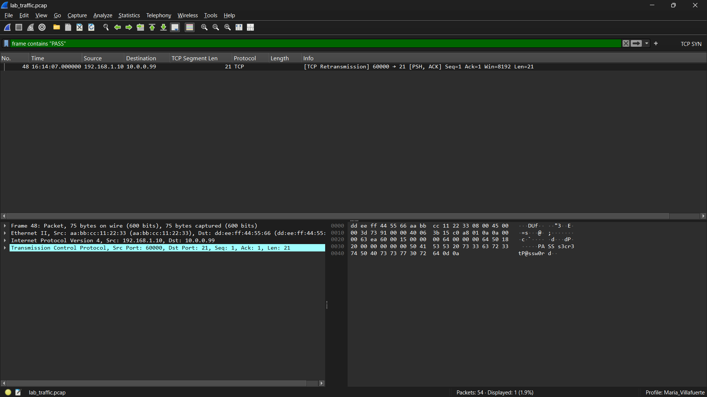

# Solución — Laboratorio: Análisis de Tráfico de Red

**Wireshark · Nmap · Hexadecimal**
Entorno: IP Cliente `192.168.1.10` | IP Objetivo `10.0.0.99`

---

## Ejercicio 1 — Credenciales FTP en texto plano

**Filtro Wireshark:**

```
ftp
```

**Filtro alternativo para búsqueda directa:**

```

frame contains "PASS"
```



**Credenciales capturadas:**

| Paquete | Dirección          | Contenido visible         |
| ------- | ------------------- | ------------------------- |
| USER    | Cliente → Servidor | `USER admin`            |
| PASS    | Cliente → Servidor | `PASS s3cr3tP@ssw0rd`   |
| 230     | Servidor → Cliente | `230 Login successful.` |

**Respuesta:** Usuario: `admin` / Contraseña: `s3cr3tP@ssw0rd`

**Riesgo:** FTP no cifra la comunicación. Cualquier nodo en la ruta de red (router, switch, atacante en modo promiscuo) puede capturar las credenciales con Wireshark o tcpdump.

**Alternativas seguras:**

- SFTP (SSH File Transfer Protocol) — cifrado SSH completo
- FTPS (FTP Secure) — FTP con TLS/SSL
- SCP (Secure Copy) — transferencia de archivos por SSH

**Flujo FTP en hexadecimal:**

```
220 = 32 32 30  (Server Ready)
USER admin = 55 53 45 52 20 61 64 6d 69 6e
331 = 33 33 31  (Password required)
PASS s3cr3tP@ssw0rd = 50 41 53 53 20 73 33 63 72 33 74 50 40 73 73 77 30 72 64
230 = 32 33 30  (Login successful)
```

---

## Ejercicio 2 — TCP 3-way Handshake

**Filtro Wireshark:**

```
tcp.flags.syn==1 && ip.dst==93.184.216.34
```

**Secuencia de paquetes:**

| Paso | Dirección          | Flags             | Seq  | Ack  | Descripción                              |
| ---- | ------------------- | ----------------- | ---- | ---- | ----------------------------------------- |
| 1    | Cliente → Servidor | **SYN**     | 1000 | 0    | Cliente solicita conexión                |
| 2    | Servidor → Cliente | **SYN-ACK** | 5000 | 1001 | Servidor acepta y responde                |
| 3    | Cliente → Servidor | **ACK**     | 1001 | 5001 | Cliente confirma — conexión establecida |

**Valores hexadecimales de flags TCP:**

| Flag    | Hex       | Binario  |
| ------- | --------- | -------- |
| SYN     | `0x002` | 00000010 |
| SYN+ACK | `0x012` | 00010010 |
| ACK     | `0x010` | 00010000 |

**Lógica de los números de secuencia:**

- El SYN consume 1 número de secuencia (`Seq=1000` → siguiente esperado: `1001`)
- El servidor responde con su propio `Seq=5000` y `Ack=1001` (confirmando el SYN del cliente)
- El cliente confirma con `Ack=5001` (confirmando el SYN del servidor)

---

## Ejercicio 3 — Detección de Escaneo Nmap SYN

**Filtros Wireshark para correlacionar el escaneo:**

```
# SYNs enviados por el escáner (192.168.1.10)
tcp.flags.syn==1 && tcp.flags.ack==0 && ip.src==192.168.1.10

# Puertos ABIERTOS: respuesta SYN-ACK del objetivo
tcp.flags==0x012 && ip.src==10.0.0.99

# Puertos CERRADOS: respuesta RST del objetivo
tcp.flags.reset==1 && ip.src==10.0.0.99

# Puertos FILTRADOS: sin respuesta (ver retransmisiones)
tcp.analysis.retransmission && ip.src==192.168.1.10
```

**Resultado del escaneo a `10.0.0.99`:**

| Puerto | Estado           | Respuesta TCP | Servicio |
| ------ | ---------------- | ------------- | -------- |
| 22     | **open**   | SYN-ACK       | SSH      |
| 80     | **open**   | SYN-ACK       | HTTP     |
| 443    | **open**   | SYN-ACK       | HTTPS    |
| 3306   | **open**   | SYN-ACK       | MySQL    |
| 23     | **closed** | RST+ACK       | Telnet   |
| 25     | **closed** | RST+ACK       | SMTP     |
| 8080   | **closed** | RST+ACK       | HTTP-alt |
| 4444   | **closed** | RST+ACK       | —       |

**Equivalente Nmap:**

```bash
nmap -sS -T4 10.0.0.99
```

**Salida esperada de Nmap:**

```
PORT     STATE  SERVICE VERSION
22/tcp   open   ssh     OpenSSH 8.9
80/tcp   open   http    Apache httpd 2.4.51
443/tcp  open   https   nginx 1.24
3306/tcp open   mysql   MySQL 8.0
23/tcp   closed telnet
25/tcp   closed smtp
8080/tcp closed http-alt
4444/tcp closed krb524
```

---

## Ejercicio 4 — Petición HTTP completa

**Pasos en Wireshark:**

1. Aplicar filtro: `http`
2. Seleccionar paquete con método GET
3. Clic derecho → **Follow → TCP Stream**

**Petición HTTP reconstruida:**

```
GET / HTTP/1.1
Host: 93.184.216.34
User-Agent: Mozilla/5.0
Accept: text/html

```

**Respuesta HTTP:**

```
HTTP/1.1 200 OK
Server: Apache/2.4.51
Content-Type: text/html; charset=UTF-8
Content-Length: 1256

<html>...</html>
```

**Campos clave identificados:**

| Campo             | Valor                        |
| ----------------- | ---------------------------- |
| Método           | `GET`                      |
| URI               | `/`                        |
| Protocolo         | `HTTP/1.1`                 |
| Código de estado | `200 OK`                   |
| Servidor          | `Apache/2.4.51`            |
| Content-Type      | `text/html; charset=UTF-8` |

**Comando tshark equivalente:**

```bash
tshark -r lab_traffic.pcap -Y http.request -T fields -e http.request.full_uri
```

---

## Análisis Hexadecimal

### Conversiones clave

| Valor                | Decimal | Hexadecimal     |
| -------------------- | ------- | --------------- |
| `G`                | 71      | `47`          |
| `E`                | 69      | `45`          |
| `T`                | 84      | `54`          |
|  (espacio)           | 32      | `20`          |
| TTL 64               | 64      | `40`          |
| Puerto 80            | 80      | `00 50`       |
| Puerto 443           | 443     | `01 BB`       |
| Puerto 3306          | 3306    | `0C EA`       |
| Puerto 22            | 22      | `00 16`       |
| IP `192.168.1.10`  | —      | `C0 A8 01 0A` |
| IP `10.0.0.99`     | —      | `0A 00 00 63` |
| IP `93.184.216.34` | —      | `5D B8 D8 22` |

### Cabecera IP (20 bytes mínimo)

```
Bytes: 45 00 00 28 12 34 00 00 40 06 XX XX C0 A8 01 0A 5D B8 D8 22
       │  │  └──┘  └──┘  └──┘  │  │  └──┘  └─────────┘  └─────────┘
       │  │  Total   ID   Flags TTL Pr Cksum   Src IP      Dst IP
       │  DSCP
       Versión(4) + IHL(5×4=20B)
```

| Bytes           | Campo        | Ejemplo        | Descripción                    |
| --------------- | ------------ | -------------- | ------------------------------- |
| `45`          | Ver + IHL    | IPv4, 20 bytes | Versión 4, cabecera 5×4 bytes |
| `00`          | DSCP/ECN     | 0              | Prioridad QoS                   |
| `00 28`       | Total Length | 40 bytes       | Tamaño total IP                |
| `40`          | TTL          | 64             | Time To Live                    |
| `06`          | Protocolo    | TCP            | 6=TCP, 17=UDP, 1=ICMP           |
| `C0 A8 01 0A` | IP Origen    | 192.168.1.10   |                                 |
| `5D B8 D8 22` | IP Destino   | 93.184.216.34  |                                 |

### Cabecera TCP (20 bytes mínimo)

```
Bytes: D4 31 00 50 00 00 03 E8 00 00 13 88 50 02 20 00 XX XX 00 00
       └──┘  └──┘  └────────┘  └────────┘  │  │  └──┘  └──┘
      Sport Dport   Seq=1000    Ack=5000   Off Fl  Win  Cksum
```

| Bytes           | Campo                | Valor      |
| --------------- | -------------------- | ---------- |
| `D4 31`       | Puerto origen        | 54321      |
| `00 50`       | Puerto destino       | 80 (HTTP)  |
| `00 00 03 E8` | Número de secuencia | 1000       |
| `00 00 13 88` | Número de ack       | 5000       |
| `02`          | Flags                | SYN        |
| `20 00`       | Ventana              | 8192 bytes |

### Tabla completa de flags TCP

| Flag    | Bits   | Hex       | Filtro Wireshark       | Uso                |
| ------- | ------ | --------- | ---------------------- | ------------------ |
| SYN     | 000010 | `0x002` | `tcp.flags==0x002`   | Inicia conexión   |
| SYN+ACK | 010010 | `0x012` | `tcp.flags==0x012`   | Servidor acepta    |
| ACK     | 010000 | `0x010` | `tcp.flags==0x010`   | Confirmación      |
| PSH+ACK | 011000 | `0x018` | `tcp.flags==0x018`   | Datos inmediatos   |
| RST     | 000100 | `0x004` | `tcp.flags.reset==1` | Resetear conexión |
| FIN     | 000001 | `0x001` | `tcp.flags.fin==1`   | Cierre ordenado    |
| RST+ACK | 010100 | `0x014` | `tcp.flags==0x014`   | Puerto cerrado     |

---

## Cuestionario de Verificación — Respuestas Completas

**Q5. ¿Qué flag TCP indica el inicio de una nueva conexión?**

**Respuesta: `SYN`**

El bit SYN inicia el three-way handshake. El proceso completo es:

1. Cliente envía **SYN** → "quiero conectarme"
2. Servidor responde **SYN-ACK** → "acepto, y también quiero conectarme"
3. Cliente confirma con **ACK** → "conexión establecida"

---

**Q6. Al escanear con Nmap, un puerto que responde con RST+ACK está:**

**Respuesta: `closed` (cerrado)**

| Respuesta     | Estado       | Significado                    |
| ------------- | ------------ | ------------------------------ |
| SYN-ACK       | `open`     | Servicio activo escuchando     |
| RST+ACK       | `closed`   | Puerto accesible, sin servicio |
| Sin respuesta | `filtered` | Firewall descarta los paquetes |

---

**Q7. ¿Por qué FTP se considera inseguro para entornos de producción?**

**Respuesta:** FTP envía las credenciales (usuario y contraseña) en **texto plano sin ningún cifrado**. Cualquier sniffer en la red (Wireshark, tcpdump) puede capturar directamente el nombre de usuario y la contraseña.

Filtro para comprobarlo: `ftp` o `frame contains "PASS"`

---

**Q8. ¿Qué protocolo usa ARP y en qué capa OSI opera?**

**Respuesta:** ARP opera en la **capa 2 (Enlace de datos)**, encapsulado directamente en tramas Ethernet. Resuelve direcciones IP a direcciones MAC dentro de la misma LAN.

- No usa IP ni TCP/UDP — va directo sobre Ethernet (EtherType `0x0806`)
- Solo funciona dentro del mismo segmento de red (broadcast domain)
- Filtro Wireshark: `arp`

---

**Q9. ¿Qué filtro Wireshark muestra solo los SYNs de un escaneo Nmap?**

**Respuesta: `tcp.flags==0x002`**

Este filtro selecciona exactamente los paquetes con **solo el bit SYN activo** (sin ACK). Los paquetes SYN-ACK (`0x012`) quedan excluidos.

Para ver solo los SYNs provenientes del escáner:

```
tcp.flags==0x002 && ip.src==192.168.1.10
```

---

**Q10. ¿Qué indica un TTL de 128 en un paquete IP?**

**Respuesta:** Un TTL de 128 indica que el paquete fue generado probablemente por un **sistema Windows** (TTL inicial = 128).

| Sistema Operativo          | TTL inicial | Hex    |
| -------------------------- | ----------- | ------ |
| Windows                    | 128         | `80` |
| Linux / macOS              | 64          | `40` |
| Cisco IOS / equipos de red | 255         | `FF` |

El TTL disminuye en 1 en cada salto de router. Si se recibe un TTL=128, el host origen es casi con certeza Windows.

---

**Q11. ¿Cuál es el puerto estándar de DNS y qué protocolo de transporte usa?**

**Respuesta:** Puerto **53**, principalmente sobre **UDP** para consultas simples.

| Situación                   | Protocolo | Puerto |
| ---------------------------- | --------- | ------ |
| Consulta normal              | UDP       | 53     |
| Respuesta > 512 bytes        | TCP       | 53     |
| Transferencia de zona (AXFR) | TCP       | 53     |
| DNS over TLS (DoT)           | TCP       | 853    |

Filtro Wireshark: `dns` o `udp.port==53`

---

**Q12. ¿Qué operación de CyberChef convierte bytes hex de Wireshark a texto legible?**

**Respuesta: `From Hex`**

En CyberChef (gchq.github.io/CyberChef):

1. Input: pegar los bytes hex separados por espacios (ej: `47 45 54 20`)
2. Operación: **From Hex**
3. Output: `GET ` (texto ASCII)

**Equivalentes en terminal:**

```bash
# Linux/macOS — xxd
echo "47455420" | xxd -r -p

# Linux/macOS — printf
printf "\x47\x45\x54\x20"

# Convertir texto a hex
echo -n "GET /" | xxd -p
```

---

## Comandos tshark de Referencia

```bash
# Listar todos los paquetes brevemente
tshark -r lab_traffic.pcap

# Ver detalles completos de cada paquete
tshark -r lab_traffic.pcap -V

# Jerarquía de protocolos en la captura
tshark -r lab_traffic.pcap -q -z io,phs

# Extraer IPs y puertos destino de todos los SYN
tshark -r lab_traffic.pcap -Y tcp.flags.syn==1 -T fields -e ip.dst -e tcp.dstport

# Ver credenciales FTP expuestas
tshark -r lab_traffic.pcap -Y ftp -T fields -e ftp.request.command -e ftp.request.arg

# Estadísticas de conversaciones TCP
tshark -r lab_traffic.pcap -q -z conv,tcp

# Extraer todas las URIs HTTP
tshark -r lab_traffic.pcap -Y http.request -T fields -e http.request.full_uri

# Filtrar paquetes de un IP específico
tshark -r lab_traffic.pcap -Y "ip.src==192.168.1.10"
```

---

## Comandos Nmap de Referencia

```bash
# Escaneo SYN (sigiloso) — requiere root/admin
nmap -sS -T4 10.0.0.99

# Detección de versiones y OS
nmap -sV -O 10.0.0.99

# Escaneo de vulnerabilidades con NSE
nmap --script vuln 10.0.0.99

# Guardar resultados en todos los formatos
nmap -sV 10.0.0.99 -oA resultados_scan
# Genera: resultados_scan.nmap, .xml, .gnmap

# Capturar el tráfico del escaneo simultáneamente
tcpdump -i eth0 -w scan_nmap.pcap &
nmap -sS 10.0.0.99
wireshark scan_nmap.pcap
```

---

## Filtros Wireshark Rápidos

| Objetivo                                | Filtro                                                           |
| --------------------------------------- | ---------------------------------------------------------------- |
| Solo ARP                                | `arp`                                                          |
| Solo DNS                                | `dns`                                                          |
| Solo HTTP                               | `http`                                                         |
| Solo FTP                                | `ftp`                                                          |
| Solo ICMP (pings)                       | `icmp`                                                         |
| SYNs (inicio/escaneo)                   | `tcp.flags==0x002`                                             |
| SYN-ACK (puertos abiertos)              | `tcp.flags==0x012`                                             |
| RST (puertos cerrados/rechazados)       | `tcp.flags.reset==1`                                           |
| Tráfico desde el cliente               | `ip.src==192.168.1.10`                                         |
| Tráfico hacia el objetivo              | `ip.dst==10.0.0.99`                                            |
| Tráfico web (80 o 443)                 | `tcp.port==80 \|\| tcp.port==443`                                |
| Buscar contraseña en cualquier paquete | `frame contains "PASS"`                                        |
| Escaneo Nmap SYN desde cliente          | `tcp.flags.syn==1 && tcp.flags.ack==0 && ip.src==192.168.1.10` |
| Puertos abiertos detectados             | `tcp.flags==0x012 && ip.src==10.0.0.99`                        |
| Retransmisiones (puertos filtrados)     | `tcp.analysis.retransmission`                                  |

---

## Resumen del Laboratorio

| Ejercicio           | Herramienta                    | Resultado clave                                      |
| ------------------- | ------------------------------ | ---------------------------------------------------- |
| Credenciales FTP    | Wireshark `ftp`              | `admin` / `s3cr3tP@ssw0rd`                       |
| 3-way handshake     | Wireshark `tcp.flags.syn==1` | SYN → SYN-ACK → ACK                                |
| Escaneo Nmap        | Wireshark + Nmap               | Abiertos: 22,80,443,3306 / Cerrados: 23,25,8080,4444 |
| HTTP en texto plano | Follow TCP Stream              | GET / → 200 OK                                      |
| Análisis hex       | CyberChef / xxd                | `47 45 54 20` = `GET `                           |

**Conclusión de seguridad:** El laboratorio demuestra que los protocolos sin cifrado (FTP, HTTP, Telnet) exponen credenciales y datos en texto plano, capturables con cualquier sniffer de red. La solución es migrar a SFTP, HTTPS, y SSH respectivamente.
